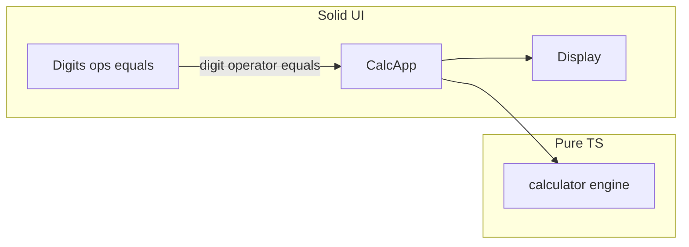

# Calculator (`apps/calculator/`) — minimal UI revision

## Constraints you just added (hard scope)

- **Do not ship** any **Clear**, **C**, **AC**, **delete/backspace**, or other extra controls.
- **Workshop later:** participants add reset/clear behavior; keep the first version intentionally incomplete from a UX standpoint.
- **Acceptable tradeoff:** the only way to “start over” in the browser is **reload the page** (or close/reopen the tab). Do not add UI for that.

Implementation should still meet [AGENTS.md](AGENTS.md): TypeScript, Solid.js, web page, unit tests, coverage **&gt; 80%**, no accessibility workshop features.

## What the UI must include (only)

- **Display** (current entry / result).
- Buttons: **0–9**, **÷ × + −**, **=**.

Nothing else on the surface.

## Engine and tests (no user-facing clear)

- The **calculator engine** can expose something like **`initialState()`** or **`createCalculator()`** used **once** at app mount—this is not a user action and **does not require** a clear button.
- **Unit tests** should construct **fresh state per test** (or call the same initializer). Do **not** rely on a user-facing `clear()` for test setup.
- Optional internal **`reset`/`clear` helpers** used **only from tests** are acceptable if they avoid polluting the UI—but simpler is to **only** export `initialState` + reducers with **digit / operator / equals** and test by spinning up new state objects.

Remove prior plan language that recommended **C/AC** or **clear** in the UI or as “recommended UX.”

## Calculator semantics (unchanged recommendation)

- Keep **immediate execution** unless you explicitly choose PEMDAS later—document in code comments.

Edge cases for tests (still relevant): **division by zero**, **leading zeros**, **chained operations / equals**—no **clear** scenarios unless testing initialization only.

## Architecture sketch (unchanged idea)

## Files / tooling

Same as before: [`apps/calculator/`](apps/calculator/) with Vite, **`vite-plugin-solid`**, Vitest + **`@vitest/coverage-v8`**, thresholds **&gt; 80%**. File list unchanged from the prior plan; only **which actions exist** in UI and public UX narrows.

## Verification checklist (updated)

- [ ] Buttons are **only** 0–9, four operators, **=** (plus display).
- [ ] No clear/delete/extra keys.
- [ ] Dev server + production build OK.
- [ ] Tests pass; coverage **&gt; 80%**.

Optional: add one line to [AGENTS.md](AGENTS.md) under calculator features noting **no clear in v1**—only if you want repo docs to match; not required for code.
